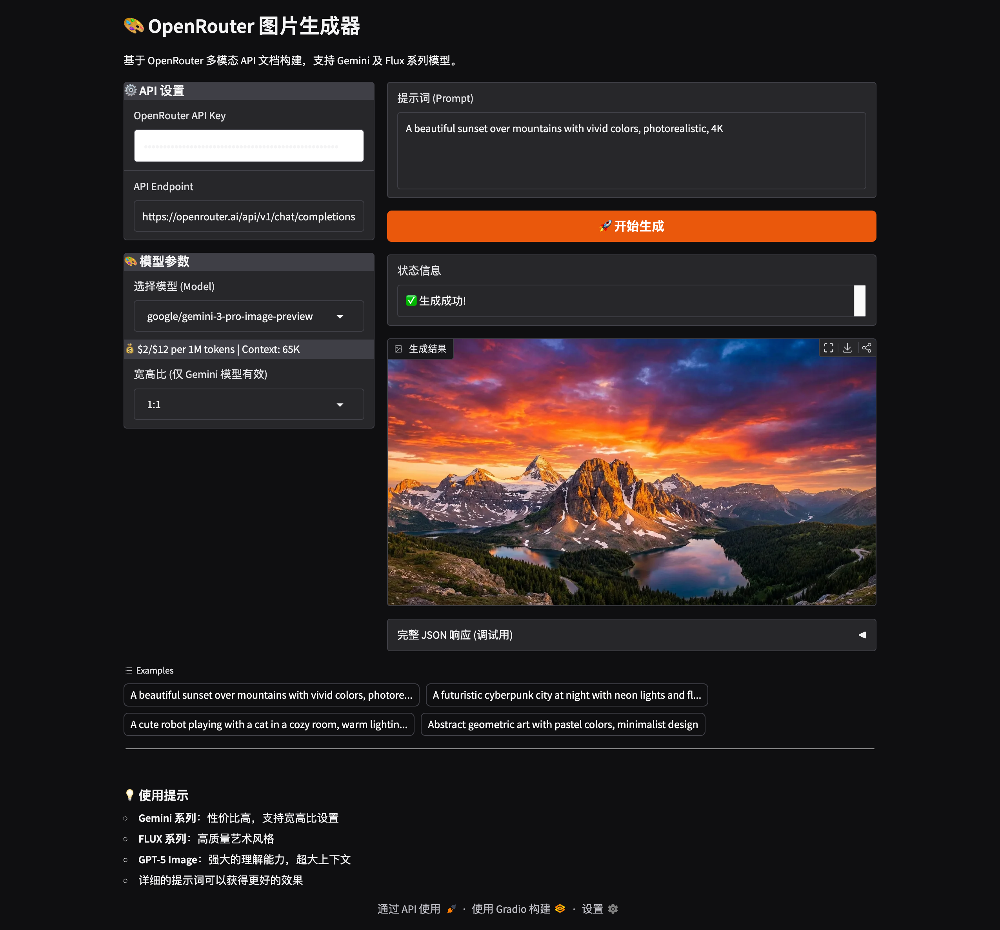

# 🎨 OpenRouter Image Generator


基于 OpenRouter 多模态 API 构建的图片生成器，支持多个先进的 AI 图像生成模型。（***使用Claude-sonnet-4.5辅助生成***）

## ✨ 功能特性

- 🤖 支持多个主流图像生成模型（Gemini、FLUX、GPT-5 Image 等）
- 🎯 自定义宽高比设置（Gemini 模型专属）
- 🖼️ 实时预览生成结果
- 📊 完整的 API 响应调试信息
- 🔒 安全的 API Key 管理

## 📷 使用截图


## 🚀 支持的模型
[查询支持模型](https://openrouter.ai/models?fmt=cards&output_modalities=image)

| 模型名称 | Model ID | 输入价格 | 输出价格 | 上下文长度 |
|---------|----------|---------|---------|-----------|
| **FLUX.2 Flex** | `black-forest-labs/flux.2-flex` | $14.64/1M | $14.64/1M | 67,344 |
| **FLUX.2 Pro** | `black-forest-labs/flux.2-pro` | $3.66/1M | $3.66/1M | 46,864 |
| **Gemini 3 Pro Image** | `google/gemini-3-pro-image-preview` | $2/1M | $12/1M | 65,536 |
| **GPT-5 Image Mini** | `openai/gpt-5-image-mini` | $2.50/1M | $2/1M | 400,000 |
| **GPT-5 Image** | `openai/gpt-5-image` | $10/1M | $10/1M | 400,000 |
| **Gemini 2.5 Flash Image** | `google/gemini-2.5-flash-image` | $0.30/1M | $2.50/1M | 32,768 |
| **Gemini 2.5 Flash Image Preview** | `google/gemini-2.5-flash-image-preview` | - | - | - |

## 📦 快速开始

### 方式一：本地运行

#### 1. 克隆仓库
```bash
git clone <your-repo-url>
cd openrouter-image-generator
```

#### 2. 安装依赖
```bash
pip install -r requirements.txt
```

#### 3. 运行应用
```bash
python app.py
```

#### 4. 访问界面
打开浏览器访问：`http://localhost:7860`

### 方式二：Docker 运行

#### 1. 构建镜像
```bash
docker build -t openrouter-image-gen .
```

#### 2. 运行容器
```bash
docker run -p 7860:7860 openrouter-image-gen
```

#### 3. 访问界面
打开浏览器访问：`http://localhost:7860`

### 方式三：Docker Compose（推荐）

创建 `docker-compose.yml`：
```yaml
version: '3.8'

services:
  app:
    build: .
    ports:
      - "7860:7860"
    environment:
      - GRADIO_SERVER_NAME=0.0.0.0
      - GRADIO_SERVER_PORT=7860
    restart: unless-stopped
```

运行：
```bash
docker-compose up -d
```

## 🔑 获取 API Key

1. 访问 [OpenRouter](https://openrouter.ai/)
2. 注册/登录账号
3. 前往 [API Keys](https://openrouter.ai/keys) 页面
4. 创建新的 API Key
5. 复制 Key（格式：`sk-or-...`）

## 📖 使用说明

### 基本使用流程

1. **输入 API Key**  
   在"OpenRouter API Key"字段中粘贴你的 API 密钥

2. **选择模型**  
   从下拉菜单中选择图像生成模型

3. **设置宽高比**（可选）  
   仅对 Gemini 系列模型有效，支持：
   - 1:1（正方形）
   - 16:9（宽屏）
   - 9:16（竖屏）
   - 其他比例...

4. **输入提示词**  
   用自然语言描述你想生成的图像，例如：
   - "A beautiful sunset over mountains with vivid colors"
   - "A futuristic city with flying cars at night"

5. **点击生成**  
   等待几秒钟即可看到生成结果

### 提示词编写技巧

- ✅ **具体描述**：包含主体、场景、风格、色彩等细节
- ✅ **使用形容词**：vivid colors、photorealistic、minimalist 等
- ✅ **指定风格**：oil painting、digital art、3D render 等
- ❌ **避免模糊**："a picture" → "a photorealistic portrait"

### 示例提示词

```
A cute robot playing with a cat in a cozy room, warm lighting, Studio Ghibli style
```

```
Futuristic cyberpunk city at night, neon lights, rain-soaked streets, cinematic composition
```

```
Minimalist geometric abstract art, pastel colors, modern design, 4K quality
```

## 🛠️ 技术栈

- **前端框架**: Gradio 
- **HTTP 客户端**: Requests
- **API 提供商**: OpenRouter

## 🐛 故障排除

### 问题：图片无法显示

**解决方案**：
- 检查 API Key 是否正确
- 确认所选模型支持图像生成
- 查看"完整 JSON 响应"中的错误信息

### 问题：请求超时

**解决方案**：
- 检查网络连接
- 尝试更换模型（某些模型响应更快）
- 简化提示词内容

### 问题：API 余额不足

**解决方案**：
- 前往 [OpenRouter Credits](https://openrouter.ai/credits) 充值
- 选择价格更低的模型（如 Gemini 2.5 Flash）

## 📝 环境变量

可选的环境变量配置：

```bash
# Gradio 服务器设置
GRADIO_SERVER_NAME=0.0.0.0    # 监听地址
GRADIO_SERVER_PORT=7860        # 监听端口

# 可选：预设 API Key（不推荐用于生产环境）
OPENROUTER_API_KEY=sk-or-...
```

## 🔒 安全建议

- ⚠️ **不要**将 API Key 硬编码到代码中
- ⚠️ **不要**将 API Key 提交到版本控制
- ✅ 使用环境变量或密钥管理服务
- ✅ 定期轮换 API Key
- ✅ 在生产环境中使用 HTTPS

## 📄 许可证

MIT License

## 🤝 贡献

欢迎提交 Issue 和 Pull Request！

## 📧 联系方式

如有问题，请通过以下方式联系：
- GitHub Issues: [项目 Issues 页面]
- Email: your-email@example.com

## 🙏 致谢

- [OpenRouter](https://openrouter.ai/) - API 提供商
- [Gradio](https://gradio.app/) - UI 框架
- [Black Forest Labs](https://blackforestlabs.ai/) - FLUX 模型
- [Google DeepMind](https://deepmind.google/) - Gemini 模型
- [OpenAI](https://openai.com/) - GPT 模型

---

**⭐ 如果这个项目对你有帮助，请给个 Star！**